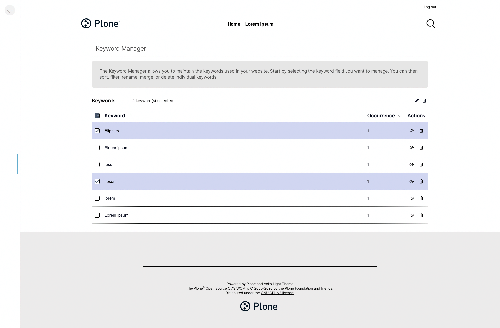

# Keyword Manager for Plone

[](https://github.com/plone/cookieplone-templates/)
[](https://github.com/astral-sh/ruff)
[](https://github.com/kitconcept/kitconcept-keywordmanager/actions/workflows/main.yml)

The **Keyword Manager** is a Plone 6 add-on that lets content editors keep their site's keywords (also called subjects or tags) clean and consistent — without needing developer support. From a dedicated control panel, editors can rename, merge, and delete keywords, and every content item on the site is updated automatically.

> [!WARNING]
> This add-on is designed to work with [volto-light-theme](https://github.com/kitconcept/volto-light-theme). If your site uses a different theme, you will need to provide your own styles or import the existing ones manually: `import "@kitconcept/volto-keywordmanager/theme/_main.scss"`. See the [Volto theming documentation](https://6.docs.plone.org/volto/theming/theming-a-base-theme.html) for details.



## Who is this for?

- **Content editors** who manage tags and subjects on a Plone website and want a clean interface to keep keywords organised.
- **Site administrators and technical staff** who need to install and configure the add-on for their institution's Plone instance.

## Features 🔥

- **Browse all keywords** currently in use, sorted by name or by number of occurrences.
- **Filter keywords** to quickly find a specific term in a long list.
- **Rename a keyword** — the new name is applied to every content item that uses it automatically.
- **Merge keywords** — combine synonyms, fix typos, or resolve ambiguities by merging multiple keywords into one canonical term; all affected content is updated in one step.
- **Delete keywords** — remove terms that are no longer needed.
- **Manage multiple keyword fields** — works with the standard `Subject` field and any other keyword-type index in the catalog.

## Requirements

- Plone 6.1 or 6.2
- Python 3.11, 3.12, or 3.13
- Volto (Plone's React-based frontend)
- [volto-light-theme](https://github.com/kitconcept/volto-light-theme) (recommended; see warning above)

## Installation 🔧

1. Frontend package:

   ```shell
   pnpm add @kitconcept/volto-keywordmanager
   ```

1. Backend package:

   ```shell
   uv add kitconcept.keywordmanager
   ```

   or

   ```shell
   pip install kitconcept.keywordmanager
   ```

## Control Panel

> [!NOTE]
> This section is a work in progress. Expect more information in the coming releases.

The Keyword Manager allows you to maintain the keywords used in your website. Start by selecting the keyword field you want to manage. You can then sort, filter, rename, merge, or delete individual keywords.

## Configuration

This package allows for some configuration.

To configure one of the following options, import the config module like so:

```py
from kitconcept.keywordmanager import config
```

### Options

The keywords permission allows you to set a custom permission who should be able to manage keywords.

```py
config.MANAGE_KEYWORDS_PERMISSION = "kitconcept.keywordmanager: Manage Keywords"
```

The meta type of the keyword indexes can be set. This is only useful if you're one of those crazy people that use custom indexes.

```py
config.META_TYPE = "KeywordIndex"
```

There are indexes of `META_TYPE` we know we don't want to manage because bad things will happen. You can exclude those using:

```py
config.IGNORE_INDEXES = [
    "object_provides",
    "allowedRolesAndUsers",
    "getRawRelatedItems",
    "getEventType",
    "block_types",
]
```

You can set a list of indexes that should always be reindex when merging or deleting keywords on objects. Most people won't need this.

```py
config.ALWAYS_REINDEX = (
    "SearchableText",
)
```

## REST-API Services

### GET `/@keywords` (or `/path/to/page/@keywords`)

| Parameter    | Source | Type / Values               | Required | Default   | Description                 |
| ------------ | ------ | --------------------------- | -------- | --------- | --------------------------- |
| `idx`        | form   | string                      | no       | "Subject" | The keyword index to query. |
| `sort_order` | form   | "ascending" or "descending" | no       | —         | The sort order of results.  |
| `sort_on`    | form   | "keyword" or "occurrence"   | no       | —         | The field to sort on.       |

### PATCH `/@keywords` (or `/path/to/page/@keywords`)

| Parameter      | Source | Type / Values | Required | Default   | Description                            |
| -------------- | ------ | ------------- | -------- | --------- | -------------------------------------- |
| `idx`          | form   | string        | no       | "Subject" | The keyword index to query.            |
| `new_keyword`  | body   | string        | yes      | —         | The name of the keyword to be created. |
| `old_keywords` | body   | list[string]  | yes      | —         | The old keywords to be deleted.        |

### DELETE `/@keywords` (or `/path/to/page/@keywords`)

| Parameter | Source | Type / Values | Required | Default   | Description                             |
| --------- | ------ | ------------- | -------- | --------- | --------------------------------------- |
| `idx`     | form   | string        | no       | "Subject" | The keyword index to query.             |
| `items`   | body   | list          | yes      | —         | The name of the keywords to be deleted. |

### GET `/@keywordIndex`

No parameters.

## Utility

Getting the utility.

```py
from kitconcept.keywordmanager.interfaces import IKeywordManager
from zope.component import getUtility

km = getUtility(IKeywordManager)
```

## Contributing 🐛

Contributions are welcome! Please read [CONTRIBUTING.md](./CONTRIBUTING.md).

## Credits and acknowledgements 🙏

This add-on is based on code from Products.PloneKeywordManager, adapted and extended for Plone 6 & Volto.

### Origins of PloneKeywordManager

PloneKeywordManager was originally written by Maik Jablonski at the Plone Paderborn Sprint in September 2003, an event funded by the Bertelsmann Foundation. Alexander Limi of Plone Solutions contributed the initial user interface updates and setup code, and Joe Geldart of Netalley Networks later brought the templates up to the Plone 2.0 format. Maik Jablonski subsequently donated the code to the Collective, allowing the community to maintain and extend it going forward.

Since then, the package has been maintained and updated through successive Plone releases by numerous contributors within the Plone Collective. The full list of contributors is available on [GitHub](https://github.com/collective/Products.PloneKeywordManager/graphs/contributors/).

### This add-on

Building on that foundation, this package was created by the kitconcept GmbH to bring keyword management to Volto.

### Long-term goal: bringing keyword management into Plone core

There is an ongoing effort to bring keyword-management functionality into Plone core itself, tracked as [PLIP: Keyword Manager](https://github.com/plone/volto/issues/5300). This add-on is intended as a step toward that goal, a working, up-to-date implementation that can inform (and hopefully eventually be folded into) that core integration. Getting there will require several steps: stabilizing the add-on for Plone 6, gathering community feedback, aligning with the Volto/core UI patterns, and going through the PLIP review process. Contributions and feedback toward that end are welcome.

Thanks to Maik Jablonski and everyone who has contributed to Products.PloneKeywordManager over the years for the original work this builds on.
